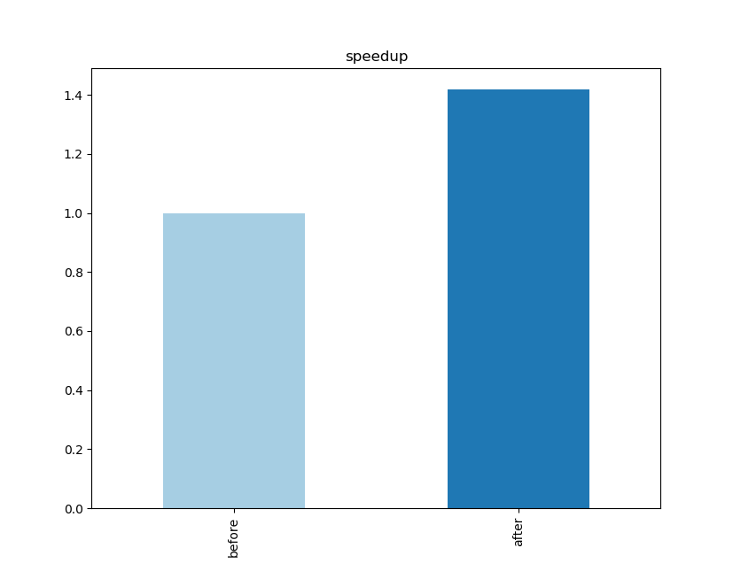

# Squeezing performance on kupe using the Cray compiler: example of an advection C++ code


## Overview 

Through a few simple steps, we show how to improve the performance of a C++ code on the NeSI Cray XC-50 system (Skylake processor 2.4GHz) installed at the National Institute for Water and Atmospheric Research (NIWA), New Zealand. 

Our example, upwindCxx, is a finite difference code written in C++ which advects (pushes) a bubble on a 3D periodic grid using an upwind algorithm. The core part of the algorithm is a loop over millions of cells where field values are taken at adjacent cells. The code is simple, comprising of a few hundred lines of code, yet complex enough to represent finite difference/element/volume codes, which share 
similar computation patterns.


## Prerequisites

To walk through the example, you will need to have access to NeSI/NIWA kupe platform and be familiar to the development environment on kupe (Unix, git, CMake and compilers). Refer  to the training deck [https://github.com/nesi/hpc_training/tree/gh-pages/_lessons/kupe] for details. 

Our starting point is the default environment with the PrgEnv-cray/6.0.4 programming environment loaded.

## Downloading and building the example code

First we need to download and build upwindCxx, which is included in the fidibench test suite:

```
git clone https://github.com/pletzer/fidibench
cd fidibench
mkdir build
cmake ..
make
```

## Our baseline result

To run upwindCxx using 40 OpenMP threads, type 
```
cd upwind/cxx
module load slurm
sbatch upwindCxx_kupe_40.sl
```
(Feel free to change the account and partition names as needed.) This gives an execution time of **48.8 sec**.

## Improving the baseline result

### Specifying the CPU target

By default, the CPU target is not set. We recommend to either
```
module load craype-broadwell
```
or
```
module load craype-x86-skylake
```
prior to compiling. This will tell the compiler to use the appropriate instruction set for the hardware. Kupe has skylake processors, which support AVX-512 vectorization. To leverage AVX-512, you'll need to load ```craype-x86-skylake```. Be aware that in some cases ```craype-broadwell``` gives better performance (it is still an open question as to why this is the case).

In our case, ```craype-broadwell``` gives 48.6 sec and ```craype-x86-skylake``` 48.7 sec, about the same time. In the following we'll choose ```craype-x86-skylake``` because we want to apply aggressive optimization options.

### Fine tuning the compiler options

We encourage you to play with compiler options - a list can be obtained with ```man crayCC```. Some of the the compiler options you may want to consider are:

 * ```-O```n where n is either 2 or 3
 * ```-h vector```n where n is 1 or 2
 * ```-h ipa```n where n is 3, 4 or 5
 * ```-h fp4```  

 To recompile with options ```-O2 -h vector2 -h fp4 -h ipa5```, go back to the build directory
 ```
 cd ../../
 make clean; rm CMakeCache.txt ; cmake -DOPT_FLAGS="-O2 -h vector2 -h fp4 -h ipa5" ..; make VERBOSE=1
 ```

 This gives **46.1 sec**, a very small improvement. 


### Ensuring that the OpenMP threads run on different physical cores

Each physical core (processor unit) supports up to two threads on the Skylake CPUs. By default, SLURM will pack as many threads as possible per processor and this can lead to contention issues. Except when hyperthreading is on, it is in general preferable to spread the threads across the physical cores (one thread for each core) and this can be achieved by adding ```--hint=nomultithread``` to the ```srun``` command in the SLURM script ```upwindCxx_kupe_40.sl```.

This gives **34.8 sec**, a 40 percent performance improvement.

## Bottom line

To reach best performance on kupe, be sure to use the right compiler options and the right environment (together). In this particular case, the biggest improvement came from using the ```srun``` option ```--hint=nomultithread```. 




